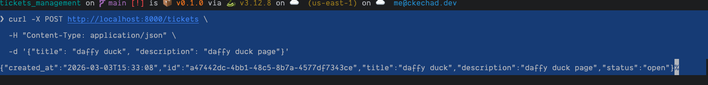

# 🎫 Tickets Management API


A REST ticket management API built with FastAPI, SQLAlchemy, and SQLite, and Langchain for chaining LLM models for
ticket resolution.

## 📋 Features

- [x] Create, list, retrieve, and update tickets
- [x] Close a ticket via a dedicated endpoint
- [x] Data validation with Pydantic
- [x] Auto-generated Swagger documentation
- [x] Tests with 100% coverage
- [x] Linting with Ruff and strict typing with Mypy
- [x] Docker & Makefile included

## 🛠️ Stack

| Tool               | Usage                |
|--------------------|----------------------|
| 🐍 Python 3.12     | Language             |
| ⚡ FastAPI          | Web framework        |
| 🪶 SQLite          | Database             |
| ✅ Pydantic         | Validation           |
| 🧪 Pytest + AnyIO  | Testing              |
| 🔍 Ruff            | Linting & formatting |
| 🔎 Mypy            | Static typing        |
| 📦 uv              | Dependency manager   |
| 🪝 pre-commit hook | Pre-commit           |
| 🐳 Docker          | Containerization     |

## 📁 Structure du projet

```
app/
├── config/
│   ├── database.py         # DB connection, SQLAlchemy table
│   ├── logging.py          # Logging configuration
│   └── settings.py         # Environment config (Dev / Test / Prod)
├── exceptions/
│   ├── business.py         # Business exceptions
│   └── http.py             # HTTP exception handler
├── middlewares/
│   └── logs.py             # Request logging middleware
├── mixins/
│   └── common.py           # Shared mixins (UUID, Timestamp)
├── models/
│   └── ticket.py           # SQLAlchemy model
├── routes/
│   └── ticket.py           # FastAPI endpoints
├── schemas/
│   └── ticket.py           # Pydantic schemas
├── services/
│   └── ticket.py           # Business logic
├── tests/
│   ├── api/                # Endpoint tests
│   ├── services/           # Service tests
│   └── conftest.py         # Pytest fixtures
├── enums.py                # TicketStatus enum
└── main.py                 # FastAPI entry point
```

## Running the Project

### Prerequisites

- [uv](https://docs.astral.sh/uv/) installé
- Python 3.12+

### Clone the project

```shell
git clone https://github.com/chkechad/tickets_management_langchain
```

### Install dependencies

```shell
uv sync
```

### Create a .env file at the root

```shell
ENV_STATE=dev
DEV_DATABASE_URL=sqlite:///dev.db
```

### Start the API

```shell
uv run uvicorn app.main:app --host 0.0.0.0 --port 8000 --reload
```

### Run the tests

```shell
uv run pytest
```

### With Docker

```shell
docker compose up --build
```

### With Makefile

#### Start the project with Docker:

```shell
make init
make env
make up
```

## 📖 Documentation

```
http://localhost:8000/docs      # Swagger
http://localhost:8000/redoc     # ReDoc
```

## 🔌 Endpoints

| Méthode | URL                          | Description       |
|---------|------------------------------|-------------------|
| `POST`  | `/tickets`                   | Create a ticket   |
| `GET`   | `/tickets`                   | List all tickets  |
| `GET`   | `/tickets/{ticket_id}`       | Retrieve a ticket |
| `PUT`   | `/tickets/{ticket_id}`       | Update a ticket   |
| `PATCH` | `/tickets/{ticket_id}/close` | Close a ticket    |

### Creation example

```shell
curl -X POST http://localhost:8000/tickets \
  -H "Content-Type: application/json" \
  -d '{"title": "daffy duck", "description": "daffy duck page"}'
```

### Curl



### Sqlite DB


## 🧪 Tests

```shell
uv run pytest

# With coverage

uv run pytest --cov=app --cov-report=term-missing
```

## 🔍 Linting & Typing

```shell
uv run ruff check .
uv run ruff format .
uv run mypy app/
```

## 🛠️ Makefile

| Commande               | Description                                    |
|------------------------|------------------------------------------------|
| `make install`         | Install dependencies and pre-commit            |
| `make init`            | Full project initialization                    |
| `make env`             | Generate .env from .env.example                |
| `make up`              | Start Docker services                          |
| `make down`            | Stop Docker services                           |
| `make logs`            | Follow app logs                                |
| `make ps`              | Show running services                          |
| `make restart`         | Restart the app                                |
| `make lint`            | Ruff check + format                            |
| `make typecheck`       | Mypy                                           |
| `make test`            | Pytest + coverage                              |
| `make coverage`        | HTML coverage report                           |
| `make docker-test`     | Pytest in docker                               |
| `make docker-test-cov` | Pytest in Docker with code coverage            |
| `make bandit`          | Code security analysis                         |
| `make security`        | Dependency audit                               |
| `make check`           | Full pipeline (lint + type + security + tests) |
| `make clean`           | Clean temporary files                          |

### Commandes essentielles

```bash
# First-time setup
make init


# Run locally with Docker
make up

# check pipeline
make check

# Run tests
make test
```

## 🌍 Environnements

| Variable            | Description                 |
|---------------------|-----------------------------|
| `ENV_STATE`         | `dev`, `prod` ou `test`     |
| `DEV_DATABASE_URL`  | URL base de données en dev  |
| `PROD_DATABASE_URL` | URL base de données en prod |
